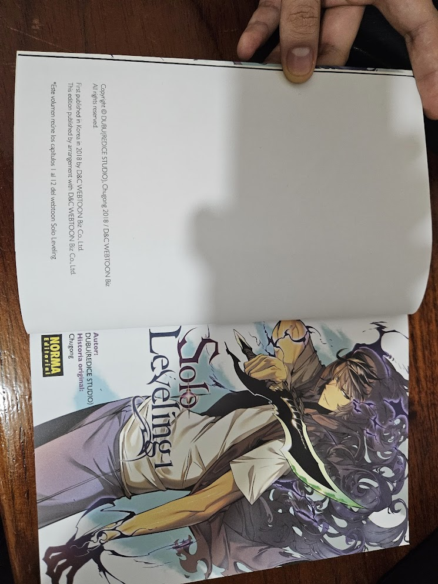
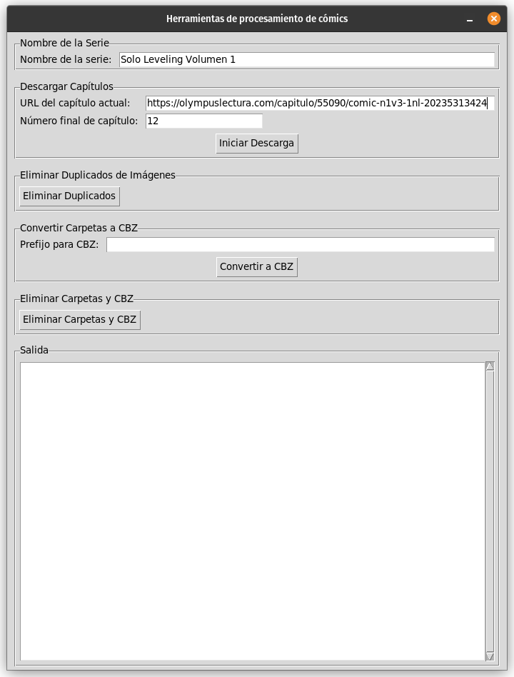
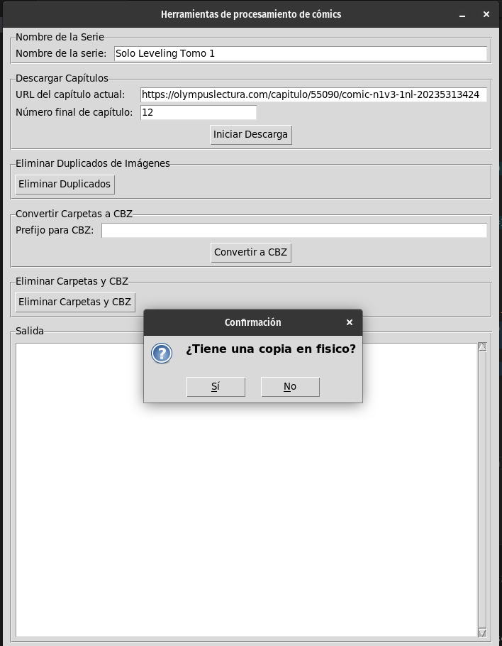
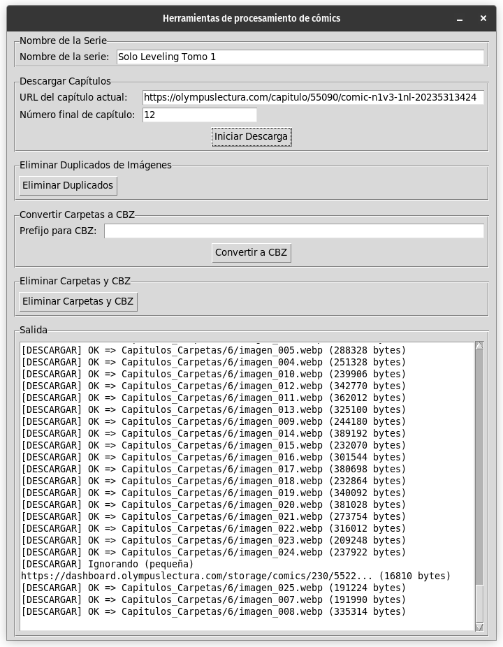
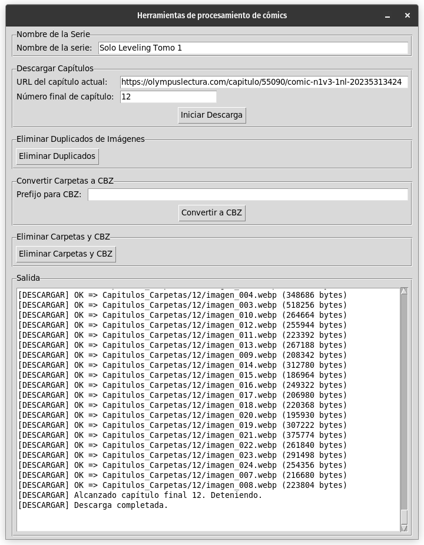
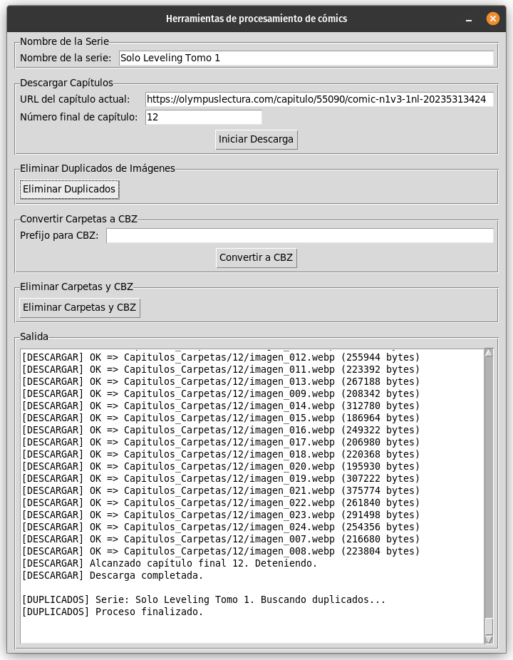
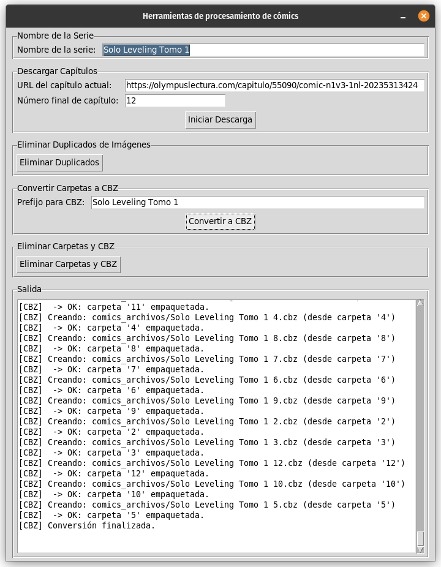
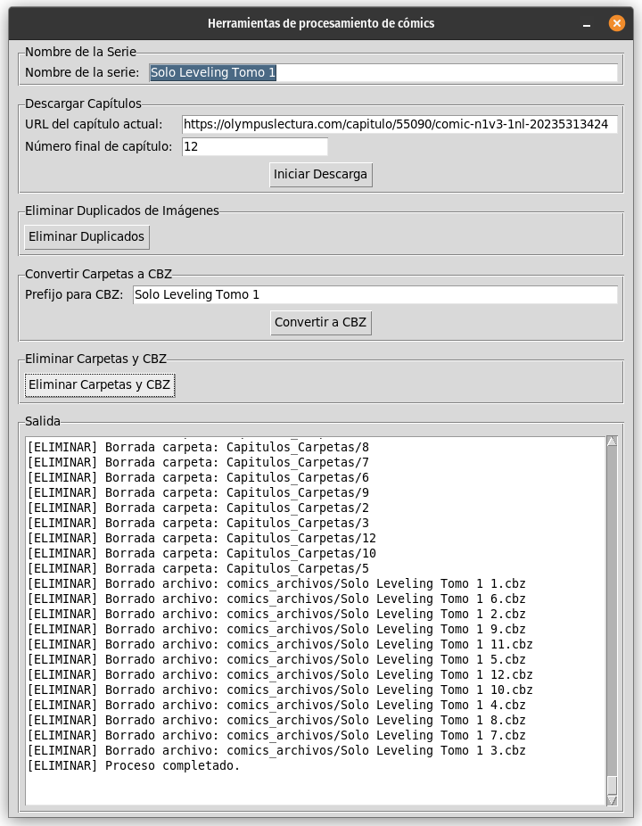
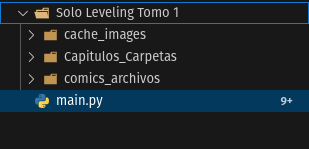

# Herramienta para Descargar Manhua

Esta aplicación en Python con interfaz Tkinter te permite:
- Descargar capítulos de un manhua/cómic usando Playwright.
- Eliminar duplicados de imágenes.
- Convertir carpetas a archivos CBZ.
- Eliminar archivos finales, etc.

## Requisitos
- **Python 3.8+**  
- Librerías (ver `requirements.txt` si está disponible):  
  - `requests`  
  - `playwright`  
  - (La librería `zipfile` suele venir incluida en Python a partir de versiones antiguas, no hace falta instalarla por separado.)

## Instalación
1. Clona el repositorio (ajusta la URL a la correcta):
   ```bash
   git clone https://github.com/joao17017/Descargar-Manhua-Olympus-Scan.git
   cd Descargar-Manhua-Olympus-Scan
    ```
2. Instala las librerias `request`, `playwright` y `zipfile`.
    ```bash
    pip install requests
    pip install zipfile
    pip install playwright
    ```
3. Instala el navegador firefox en playwright
    ```bash
    playwright install firefox
    ```
4. Inicia el Scrip
    ```bash
    python3 main.py
    ```
    
## 🎈 Uso
1. Ten una copia física o legal del material que vas a descargar (respeta los derechos de autor).

2. En la interfaz, ingresa:
- El enlace (URL) del capítulo actual que deseas descargar
- El nombre del manhua (o serie)
- Y el número de capítulo máximo a descargar
3. Clic al boton Iniciar Descarga

- Haz clic en Iniciar Descarga y sigue las indicaciones

- Espera mientras se crea la copia de seguridad virtual de tu material fisico

- Fin del proceso de copia de seguridad virtual de tu material

4. Clic Eliminar Duplicados

5. Clic en Convertir a CBZ para que las carpetas se conviertan en archivos .cbz

6. Clic en Eliminar Carpetas y CBZ para eliminar los archivos generados

7. Distribucion de las carpetas, no olvides borrar el cache_images en caso de ser necesario

## ⛏️ Construido con:
- [Python](https://www.python.org/) - Language
- [Tkinter](https://docs.python.org/es/3.13/library/tkinter.html) - UI Python
- [Playwright](https://playwright.dev/) - Playwright

## Licencia

Este proyecto se distribuye bajo la **[Licencia Creative Commons Atribución-NoComercial 4.0 Internacional](./LICENSE)**.  

Eso significa que puedes usar, copiar y modificar este código para fines **no comerciales**, siempre y cuando:

1. **Mantengas la atribución al autor** original.
2. **No** utilices el material con fines comerciales.
3. Incluyas un enlace a la licencia y detalles de cualquier cambio realizado.
